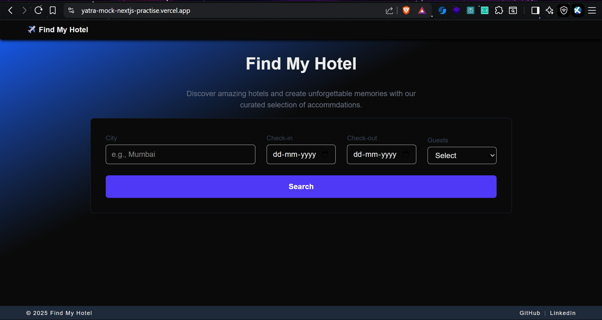
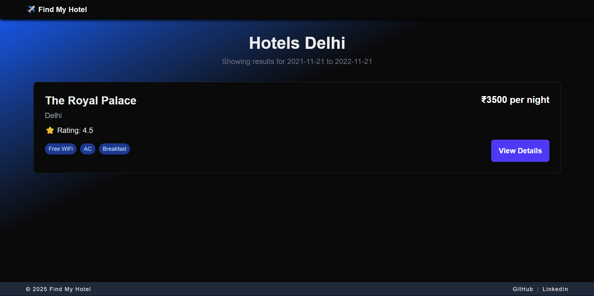
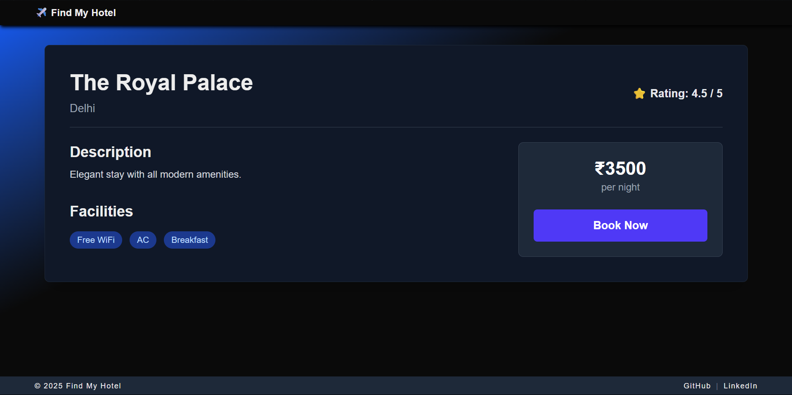
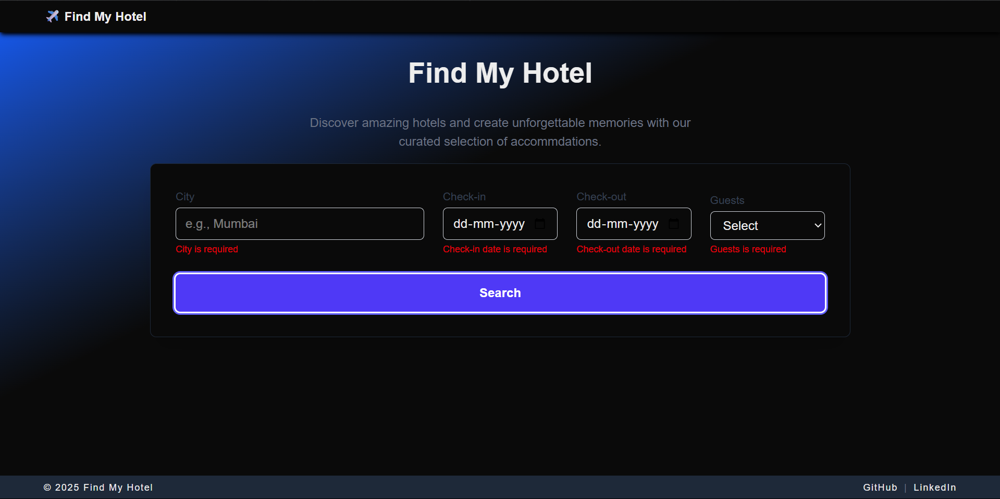
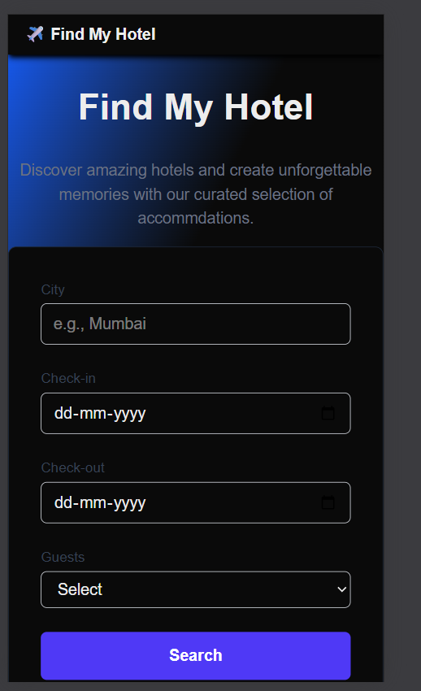
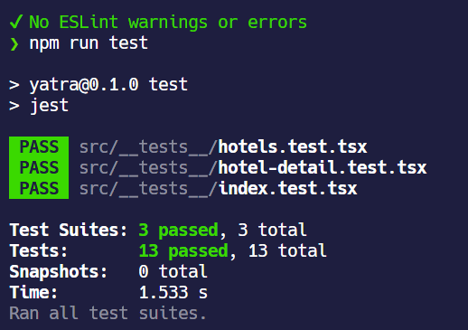
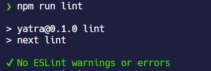
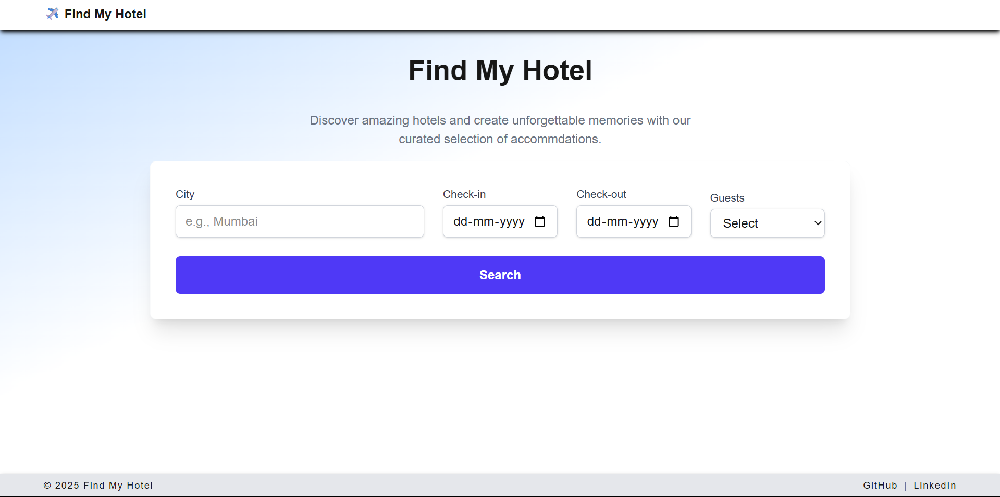

# Find My Hotel frontend exercise

Deployed on https://yatra-mock-nextjs-practise.vercel.app/

## Setup instructions
First, clone the repo:
```bash
git clone https://github.com/xylarshayu/yatra-mock-nextjs-practise.git
```

Then install dependencies:
```bash
npm ci
```

Finally, run the development server:
```bash
npm run dev
```

You may now open [http://localhost:3000](http://localhost:3000) with your browser to see the result.

## Features implemented

1. Hotel search form, hotel listings, and hotel details page
   1. Hotel search form allows one to search for accommodations based on desired city, staying period and number of guests 
   2. Hotel listings show all the available hotels that match the city parameter of their search. A search button for each hotel let's them navigate to the hotel's details 
   3. Hotel details page shows the details of the hotel selected. A book now button shows an alert 
2. Error and loading states 
3. Responsiveness 
4. Testing suite for all three pages to ensure stability and fulfillment of above features 
5. Linting and type-safety to ensure maintainability of all features 
6. Accessibility, for example via dark/light-mode depending on user's system color scheme preference 

## Assumptions made

Intention of this repo was to try to mirror what a real-world project structure for such a project may look like, while keeping it a frontend-focused project. Test-cases etc were written pretending that it should be applicable for a real-world-project.